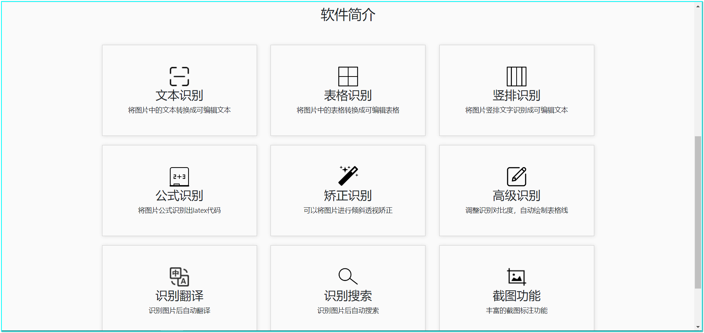
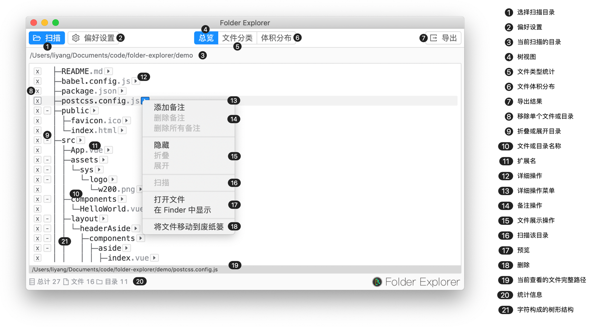

	

# Awesome Software

   

Keep track of any software that works better.

It is only your personal opinion whether it is good or not.

If you have any questions (problem or recommend software), you can submit issue or PR.

If any infringing content, please [contact me](<mailto:sheng.yan836@gmail.com>) to delete it.

## Free

### Everything

official website: <https://www.voidtools.com/> .

"Everything" is search engine that locates files and folders by filename instantly for Windows.

Unlike Windows search "Everything" initially displays every file and folder on your computer (hence the name "Everything").

You type in a search filter to limit what files and folders are displayed.

**Platform**: Windows .

### Typora

official website: <https://www.typora.io/> .

Typora is a cross-platform minimal markdown editor, providing seamless experience for both markdown readers and writers.

Typora gives you a seamless experience as both a reader and a writer. It removes the preview window, mode switcher, syntax symbols of markdown source code, and all other unnecessary distractions. Instead, it provides a real live preview feature to help you concentrate on the content itself.

**Platform**: Windows/Mac/Linux .

### FastStone Capture

official website: <https://faststone-capture.en.softonic.com/>  .

FastStone Free Capture (FSCapture) is a free image viewer, editor and screen capture that supports all major graphic formats including BMP, JPEG, JPEG 2000, GIF, PNG, PCX, TIFF, WMF, ICO and TGA. With its amazingly smooth and crystal-clear magnifier, every detail of images can be viewed gracefully in full screen without compromising the quality.

Its Resizing, Rotating, Cropping, Color adjusting tools with Undo support enable image enhancement easier than ever. Its screen capturing allows you to capture anything on the screen within just a couple of mouse clicks. Its drag & drop enables you to drag images from windows, Internet browsers and other programs directly to this program.

simple use: <https://blog.csdn.net/weixin_41287260/article/details/94592405>  .

**Platform**: Windows .

### 天若OCR

official website: <https://tianruoocr.cn/>  .

An OCR text recognition software, OCR recognition of small tools set baidu, Tencent, youdao, sogou four text recognition interface, called the OCR interface of the major websites, free unlimited number of times (youdao free interface has IP restrictions only for entertainment), simple and practical functions, let you identify the content you want to identify at will.

Note: Premium features are charged.

**Platform**: Windows .

### Folder Explorer

official website: <https://d2.pub/zh/doc/folder-explorer/>  .

GitHub: <https://github.com/d2-projects/folder-explorer> 

Scanning directories, analyzing file structure and statistics, adding notes to arbitrary files, exporting annotated tree text and other data formats, greatly facilitating the writing of technical documents.

function: 

- Scans the specified directory (drag-and-drop enabled) and scans the specified directory in the current result again
- Displays tree statistics of file structure, supports adding comments, and hides individual file or folder contents
- File type statistics
- File volume distribution statistics
- Export text tree structure diagram, support comments and automatic alignment, support custom content format
- Export JSON files and XML files for use by other software or programs
- Export the Xmind structure diagram to support content formatting for custom nodes, labels, and comments
- Custom export file name default
- Annotation information memory function
- Backup and import of personalized Settings
- Other rich Settings options

**Platform**: Windows/Mac/Linux.

### PicGo

official website：<https://molunerfinn.com/PicGo/> .

GitHub：<https://github.com/Molunerfinn/PicGo> .

A tool for quickly uploading images and getting URL links to images.

#### PicGo ontology supports the following picture bed

- `Seven ox chart bed` V1.0
- `Tencent Cloud COS v4\V5 version` V1.1 & V1.5.0
- `again clap cloud` V1.2.0
- `making` v1.5.0
- `SM. MS V2` v2.3.0 - beta. 0
- `Aliyun OSS` V1.6.0
- `Imgur` v1.6.0

#### Feature features

- Support drag and drop image upload
- Supports shortcuts to upload the first image in the clipboard
- Windows and macOS support right-clicking image files uploaded via menu (V2.1.0 +)
- Automatically copy and link to clipboard after uploading image
- Supports custom copy to clipboard link formats
- support to modify shortcuts, default quick upload shortcut: 'command+shift+p' (macOS) | 'control+shift+p' (Windows\Linux)
- Support plug-in system, existing plug-ins support Gitee, Qingyun and other third party graphics bed
- more third-party plug-ins and using the PicGo at the bottom of the application can be found in [Awesome - PicGo](https://github.com/PicGo/Awesome-PicGo). Contributions are welcome!
- Supports PicGo uploads by sending HTTP requests (V2.2.0 +)
- More and more for you to discover on your own, as well as constantly developing new features
- developing schedule can view [Projects](https://github.com/Molunerfinn/PicGo/projects), synchronous update development progress
  Welcome to the [official Gitter channel](<https://gitter.im/picgo-all/PicGo?Utmsource=share-link&UTM_medium=link&UTM_campaign=share-link>) communicate with me

**Platform**: Windows/Mac/Linux .

## Pay

### Beyond Compare

official website:<https://www.scootersoftware.com/index.php> .

Beyond Compare is a multi-platform utility that combines directory compare and file compare functions in one package.  Use it to manage source code, keep directories in sync, compare program output, etc.

**Platform**: Windows/Mac/Linux .
