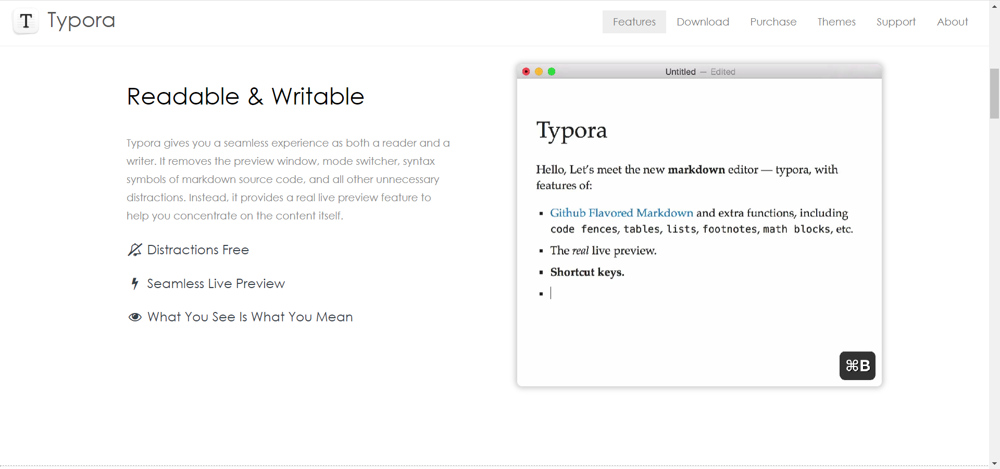
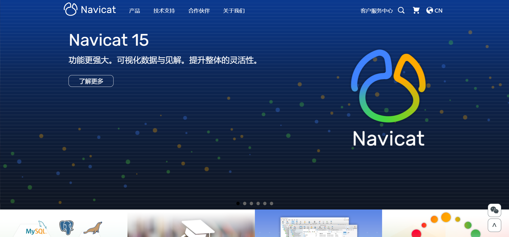

	

# Awesome Software

   

优秀的软件。记录使用过的比较好用的软件，有免费的，也有付费的。

「好不好用」只是个人的看法，所以，是否使用，还是由你自己决定。

有任何问题（纠错、推荐软件……）都可以提issue或者PR。

如侵权内容，请 [联系我](<mailto:sheng.yan836@gmail.com>) 进行删除。

## 搜索软件

### Everything--win全局搜索

官网：<https://www.voidtools.com/zh-cn/> 。

"Everything" 是 Windows 上一款搜索引擎，它能够基于文件名快速定文件和文件夹位置。

不像 Windows 内置搜索，"Everything" 默认显示电脑上每个文件和文件夹 (就如其名 "Everything")。

您在搜索框输入的关键词将会筛选显示的文件和文件夹。

**系统兼容**：Windows 。

**是否付费**：免费。

**下载**：<https://www.voidtools.com/zh-cn/downloads/> 。

### Listary--win全局搜索

官网：<https://www.listary.com/> 。

Listary是一款革命性的Windows搜索工具。
这使得查找文件和启动应用程序的速度非常快，对于普通用户和高级用户都是如此！

**系统兼容**：Windows 。

**是否付费**：普通版免费；专业版需要付费。

**下载**：<https://www.listary.com/download> 。

## 文本编辑器

### Typora--Markdown编辑器

官网：<https://www.typora.io/> 。

Typora是一款跨平台的最小Markdown编辑器，可为Markdown读者和作家提供无缝的体验。

Typora给您既是读者又是作家的无缝体验。它删除了预览窗口，模式切换器，降价源代码的语法符号以及所有其他不必要的干扰。相反，它提供了真正的实时预览功能，可帮助您专注于内容本身。

该软件支持两个实用的功能（需要安装下面个两个软件（插件））：

- [pandoc](#Pandoc)：将其他格式导入（成Markdown文件），导出成其他格式文件（PDF/word/html……）。
- [PicGo](#PicGo)：图片上传（阿里云、github、gitee等各种常见的云空间）。

**系统兼容**：Windows/macOS/Linux 。

**是否付费**：一开始免费；后面好像从哪个版本开始收费了（但是之前的版本还是可用的）。15天试用+会员。

**下载**：<https://www.typora.io/#download> 。

### Notepad++--纯文本编辑器

官网：<https://notepad-plus-plus.org/> 。

GitHub：<https://github.com/notepad-plus-plus/notepad-plus-plus> 。

Notepad++ 是一个免费的源代码编辑器和支持多种语言的记事本替代品。支持各种扩展性插件。

关键词：轻量级、插件

**系统兼容**：Windows/macOS/Linux 。

**是否付费**：开源，免费。

**下载**：<https://notepad-plus-plus.org/downloads/> 。

## 图片工具

### FastStone Capture--截图工具

官网：<https://www.faststone.org/FSCaptureDetail.htm> 。

非官网：<https://faststone-capture.en.softonic.com/> 。

FastStone Capture（FSCapture）是一种图像查看器，编辑器和屏幕截图，支持所有主要图形格式，包括BMP，JPEG，JPEG 2000，GIF，PNG，PCX，TIFF，WMF，ICO和TGA。凭借其惊人的平滑和清晰的放大镜，可以在全屏幕上优雅地观看图像的每个细节，而不会影响质量。

它的“缩放”，“旋转”，“裁切”，“色彩”调整工具以及“撤消”支持使图像增强比以往更加容易。它的屏幕捕获功能使您只需单击几下鼠标即可捕获屏幕上的所有内容。其拖放功能使您可以将图像从Windows，Internet浏览器和其他程序直接拖动到该程序。

简介和使用可参考：<https://blog.csdn.net/weixin_41287260/article/details/94592405> 。

**系统兼容**：Windows 。

**是否付费**：30天试用+会员。

**下载**：<https://www.faststone.org/FSCaptureDownload.htm> , <https://faststone-capture.en.softonic.com/download> 。

### 天若OCR文字识别--OCR

官网：<https://tianruoocr.cn/> 。

一款OCR文字识别软件，OCR识别的小工具集合百度、腾讯、有道、搜狗四条文字识别接口，调用了各大网站的ocr接口，免费不限次数（有道免费接口有ip限制仅供娱乐），功能简单实用，让你随意识别想要识别的内容。

**系统兼容**：Windows 。

**是否付费**：有免费版；高级功能需要付费。

**下载**：<https://tianruo.lanzoux.com/b0mn2zif> 。

## 视频工具

### FFmpeg--视频压缩工具

**官网**： <https://ffmpeg.org/>。

**GitHub**：<https://git.ffmpeg.org/ffmpeg.git>，<https://github.com/FFmpeg/FFmpeg>。

FFmpeg 是一个库和工具的集合，用于处理音频、视频、字幕和相关元数据等多媒体内容。

**系统兼容**：Windows/macOS/Linux 。

**是否付费**：开源，免费。

**下载**：<https://github.com/FFmpeg/FFmpeg/releases>。

## 文件管理工具

### WizTree--磁盘空间分析器

官网：<https://www.diskanalyzer.com/> 。

最快的磁盘空间分析器。查找占用硬盘空间最多的文件和文件夹。

关键词：个人免费。

**系统兼容**：Windows。

**是否付费**：。

**下载**：<> 。

### Folder Explorer--文件树浏览

官网：<https://d2.pub/zh/doc/folder-explorer/> 。

GitHub： <https://github.com/d2-projects/folder-explorer> 。

扫描目录，分析文件结构和统计信息，给任意文件添加备注，导出带注释的树形文本和其它多种数据格式，大大方便书写技术文档。

#### 功能

- 扫描指定的目录（支持拖拽）以及再次扫描当前结果中的指定目录
- 展示文件结构的树形统计，支持添加注释，隐藏单个文件或者文件夹内容
- 文件类型统计
- 文件体积分布统计
- 导出文字构成的树形结构图，支持注释和自动对齐，支持自定义内容格式
- 导出 json 文件和 xml 文件供其他软件或者程序使用
- 导出 xmind 结构图，支持自定义节点、label 和注释的内容格式化
- 自定义导出文件的名称预设
- 注释信息记忆功能
- 个性化设置的备份和导入
- 其它丰富的设置选项

**系统兼容**：Windows/macOS/Linux。

**是否付费**：开源，免费。

**下载**：<https://github.com/d2-projects/folder-explorer/releases> 。

### Pandoc--文件转换

官网：<https://www.pandoc.org/> 。

GitHub：<https://github.com/jgm/pandoc> 。

Pandoc是一个用于从一种标记格式转换到另一种标记格式的Haskell库，也是一个使用该库的命令行工具。

一个通用的文件转换器，支持很多种格式，可参考下图，或者是[官网](https://www.pandoc.org/)介绍。

**系统兼容**：Windows/macOS/Linux。

**是否付费**：开源，免费。

**下载**：<https://github.com/jgm/pandoc/releases> 。

### PicGo--图片上传(图床)

官网：<https://molunerfinn.com/PicGo/> 。

GitHub：<https://github.com/Molunerfinn/PicGo> 。

一个用于快速上传图片并获取图片 URL 链接的工具。

#### PicGo 本体支持如下图床

- `七牛图床` v1.0
- `腾讯云 COS v4\v5 版本` v1.1 & v1.5.0
- `又拍云` v1.2.0
- `GitHub` v1.5.0
- `SM.MS V2` v2.3.0-beta.0
- `阿里云 OSS` v1.6.0
- `Imgur` v1.6.0

#### 特色功能

- 支持拖拽图片上传
- 支持快捷键上传剪贴板里第一张图片
- Windows 和 macOS 支持右键图片文件通过菜单上传 (v2.1.0+)
- 上传图片后自动复制链接到剪贴板
- 支持自定义复制到剪贴板的链接格式
- 支持修改快捷键，默认快速上传快捷键：`command+shift+p`（macOS）| `control+shift+p`（Windows\Linux)
- 支持插件系统，已有插件支持 Gitee、青云等第三方图床
  - 更多第三方插件以及使用了 PicGo 底层的应用可以在 [Awesome-PicGo](https://github.com/PicGo/Awesome-PicGo) 找到。欢迎贡献！
- 支持通过发送 HTTP 请求调用 PicGo 上传（v2.2.0+)
- 更多功能等你自己去发现，同时也会不断开发新功能
  - 开发进度可以查看 [Projects](https://github.com/Molunerfinn/PicGo/projects)，会同步更新开发进度
  - 欢迎加入 [官方 Gitter 频道](https://gitter.im/picgo-all/PicGo?utm_source=share-link&utm_medium=link&utm_campaign=share-link) 与我交流

**系统兼容**：Windows/macOS/Linux 。

**是否付费**：开源，免费。

**下载**：<https://github.com/Molunerfinn/PicGo/releases> 。

### ExifTool--图片元信息

官网：<https://exiftool.org/>

一个独立于平台的 Perl 库和一个命令行应用程序，用于读取、写入和编辑各种文件中的元信息。 

ExifTool 支持多种不同的元数据格式，包括jpeg/jpg/png/gif等。

ExifTool是一个独立于平台的Perl库，加上一个命令行应用程序，用于读取、写入和编辑各种文件中的元信息。ExifTool支持许多不同的元数据格式包括EXIF, GPS, IPTC, XMP,就是以前,GeoTIFF, ICC档案,Photoshop IRB, FlashPix,大使基金和ID3 Lyrics3,以及制造商的许多由佳能数码相机,卡西欧,收,FLIR,富士胶片,通用电气还装有,惠普,JVC /维克多,柯达、叶、美能达/柯尼卡美能达、摩托罗拉、尼康、任天堂、奥林巴斯/爱普生、松下/徕卡、宾得/朝日、Phase One、Reconyx、理光、三星、三洋、Sigma/Foveon、索尼。

（ExifTool supports many different metadata formats including [EXIF](https://exiftool.org/TagNames/EXIF.html), [GPS](https://exiftool.org/TagNames/GPS.html), [IPTC](https://exiftool.org/TagNames/IPTC.html), [XMP](https://exiftool.org/TagNames/XMP.html), [JFIF](https://exiftool.org/TagNames/JFIF.html), [GeoTIFF](https://exiftool.org/TagNames/GeoTiff.html), [ICC Profile](https://exiftool.org/TagNames/ICC_Profile.html), [Photoshop IRB](https://exiftool.org/TagNames/Photoshop.html), [FlashPix](https://exiftool.org/TagNames/FlashPix.html), [AFCP](https://exiftool.org/TagNames/AFCP.html) and [ID3](https://exiftool.org/TagNames/ID3.html), [Lyrics3](https://exiftool.org/TagNames/ID3.html#Lyrics3), as well as the maker notes of many digital cameras by [Canon](https://exiftool.org/TagNames/Canon.html), [Casio](https://exiftool.org/TagNames/Casio.html), [DJI](https://exiftool.org/TagNames/DJI.html), [FLIR](https://exiftool.org/TagNames/FLIR.html), [FujiFilm](https://exiftool.org/TagNames/FujiFilm.html), [GE](https://exiftool.org/TagNames/GE.html), [GoPro](https://exiftool.org/TagNames/GoPro.html), [HP](https://exiftool.org/TagNames/HP.html), [JVC/Victor](https://exiftool.org/TagNames/JVC.html), [Kodak](https://exiftool.org/TagNames/Kodak.html), [Leaf](https://exiftool.org/TagNames/Leaf.html), [Minolta/Konica-Minolta](https://exiftool.org/TagNames/Minolta.html), [Motorola](https://exiftool.org/TagNames/Motorola.html), [Nikon](https://exiftool.org/TagNames/Nikon.html), [Nintendo](https://exiftool.org/TagNames/Nintendo.html), [Olympus/Epson](https://exiftool.org/TagNames/Olympus.html), [Panasonic/Leica](https://exiftool.org/TagNames/Panasonic.html), [Pentax/Asahi](https://exiftool.org/TagNames/Pentax.html), [Phase One](https://exiftool.org/TagNames/PhaseOne.html), [Reconyx](https://exiftool.org/TagNames/Reconyx.html), [Ricoh](https://exiftool.org/TagNames/Ricoh.html), [Samsung](https://exiftool.org/TagNames/Samsung.html), [Sanyo](https://exiftool.org/TagNames/Sanyo.html), [Sigma/Foveon](https://exiftool.org/TagNames/Sigma.html) and [Sony](https://exiftool.org/TagNames/Sony.html).）

**系统兼容**：Windows/macOS/Linux 。

**是否付费**：开源，免费。

**下载**：<https://exiftool.org/> 。

### TrafficMonitor--win桌面悬浮窗软件

官网/GitHub：<https://github.com/zhongyang219/TrafficMonitor> 。

Traffic Monitor是一款用于Windows平台的网速监控悬浮窗软件，可以显示当前网速、CPU及内存利用率，支持嵌入到任务栏显示，支持更换皮肤、历史流量统计等功能。

**系统兼容**：Windows。

**是否付费**：开源，免费。

**下载**：<https://github.com/zhongyang219/TrafficMonitor/releases> 。

### Itraffic--Mac网速监控软件

官网/GitHub：<https://github.com/foamzou/ITraffic-monitor-for-mac> 。

能够在 mac 平台下，实时观测到每个进程的网络速率。SwiftUI 编写，适配暗黑主题。

**系统兼容**：mac。

**是否付费**：开源，免费。

**下载**：<https://github.com/foamzou/ITraffic-monitor-for-mac/releases> 。

## 开发工具

### Git--版本控制系统

官网：https://git-scm.com/ 。

GitHub：<https://github.com/git/git> 。

Git 是一个免费的开源分布式版本控制系统，旨在快速高效地处理从小到大的所有项目。

是大牛Linus Torvalds开发的，旨在管理Linux代码库。

程序猿必备。

在Windows系统中运行Linux命令，这亦是一个不错的工具。

远程仓库：[GitHub](https://github.com/) （GitHubDesktop）、[Gitee](https://gitee.com/)、[Bitbucket](https://bitbucket.org/product/) （SourceTree）、[Gitlab](https://about.gitlab.com/) 。

**系统兼容**：Windows/macOS/Linux 。

#### 相关工具

##### git diff工具

文本类：Beyond Compare、DiffMerge。

图片类：ExifTool 

docx：pandoc

##### 目录生成工具

github-markdown-toc：<https://github.com/ekalinin/github-markdown-toc> 

##### 移除历史中已经删除的大文件

<https://docs.github.com/en/github/authenticating-to-github/keeping-your-account-and-data-secure/removing-sensitive-data-from-a-repository> 

工具bfg：<https://rtyley.github.io/bfg-repo-cleaner/> 

### IntelliJ--开发套件

官网：<https://www.jetbrains.com/>

软件开发人员和团队的基本工具。

有多种开发工具，适用于多种常用的编程语言，而且各种插件很成熟。

- [IntelliJ IDEA](https://www.jetbrains.com/idea/)：Java, Kotlin, Groovy, Scala
- [PhpStorm](https://www.jetbrains.com/phpstorm/)：Php
- [PyCharm](https://www.jetbrains.com/pycharm/)：Python
- [Rider](https://www.jetbrains.com/rider/)：.NET
- [RubyMine](https://www.jetbrains.com/ruby/)：Ruby and Rails, JavaScript and CoffeeScript, ERB and HAML, CSS, Sass and Less, and more.
- [WebStorm](https://www.jetbrains.com/webstorm/)：JavaScript 

#### IntelliJ IDEA

**官网**：<https://www.jetbrains.com/idea/>

**系统兼容**：Windows/macOS/Linux 。

**是否付费**：社区版（Community）免费；最终版（Ultimate）30天试用+会员。

**下载**：<https://www.jetbrains.com/idea/download/#section=windows>。

#### PyCharm

**官网**：<https://www.jetbrains.com/pycharm/>

**系统兼容**：Windows/macOS/Linux 。

**是否付费**：社区版（Community）免费，专业版（Professional）付费。

**下载**：<https://www.jetbrains.com/pycharm/download/#section=windows>。

#### WebStorm

**官网**：<https://www.jetbrains.com/webstorm/>

**系统兼容**：Windows/macOS/Linux 。

**是否付费**：30天试用+会员。

**下载**：<https://www.jetbrains.com/webstorm/download/#section=windows>。

#### PhpStorm

**官网**：<https://www.jetbrains.com/phpstorm/>

**系统兼容**：Windows/macOS/Linux 。

**是否付费**：30天试用+会员。

**下载**：<https://www.jetbrains.com/phpstorm/download/#section=windows>。

### HTTP Debugger--抓包工具

官网：<http://www.httpdebugger.com/>

调试对后端和后端之间的 HTTP API 调用。

**HTTP Debugger抓包调试工具**是来自国外的一款操作简单，功能强大的网络抓包神器，软件也是专为网站开发者设计的网站调试工具，可以对客户端浏览器和网站服务器之间的通信进行捕获、分析和调试。

**What Makes HTTP Debugger So Different?**

-  Clean UI and very easy to use.
-  Displays HTTP/s traffic from any browser and .NET, JAVA, and C ++ applications.
-  Displays in/out traffic for locally running web servers (Node.js, Apache, IIS Express).
-  You can edit and resubmit HTTP sessions and modify HTTP traffic on-the-fly.
-  It's not a proxy and does not cause network problems!

**系统兼容**：Windows 。

**是否付费**：7天试用+会员。

**下载**： <https://www.httpdebugger.com/downloads/HTTPDebuggerPro.msi> 。

## 文件对比工具

### Beyond Compare

官网：<https://www.scootersoftware.com/index.php> 。

Beyond Compare是一个多平台实用程序，它将目录比较和文件比较功能组合在一个包中。使用它来管理源代码，保持目录同步，比较程序输出，等等。

试用一段时间后需要付费。

**系统兼容**：Windows/macOS/Linux。

**是否付费**：30天试用+会员。

**下载**： <https://www.scootersoftware.com/download.php> 。

### WinMerge

官网：<https://winmerge.org/> 。

GitHub：<https://github.com/winmerge/winmerge> 。

WinMerge是一个开源的Windows差异和合并工具。WinMerge可以比较文件夹和文件，以易于理解和处理的可视文本格式呈现差异。

**系统兼容**：Windows 。

**是否付费**：开源，免费。

**下载**： <https://github.com/WinMerge/winmerge/releases/download/v2.16.18/WinMerge-2.16.18-Setup.exe> 。

## 数据库工具

### Navicat

官网：<http://www.navicat.com.cn/>

Navicat Premium 15 是一套多连接数据库开发工具，让你在单一应用程序中同时连接多达七种数据库：MySQL、MariaDB、MongoDB、SQL Server、SQLite、Oracle 和 PostgreSQL，可一次快速方便地访问所有数据库。

**系统兼容**：Windows/macOS/Linux 。

**是否付费**：14天体验+会员。

**下载**： <http://www.navicat.com.cn/download/navicat-premium> 。

## Star History

