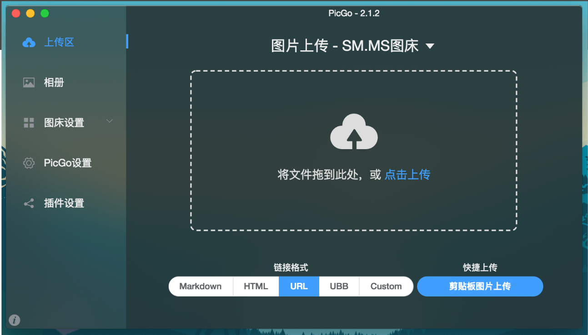

	

# Awesome Software

   

优秀的软件。记录使用过的比较好用的软件，有免费的，也有付费的。

「好不好用」只是个人的看法，所以，是否使用，还是由你自己决定。

有任何问题（纠错、推荐软件……）都可以提issue或者PR。

如侵权内容，请 [联系我](<mailto:sheng.yan836@gmail.com>) 进行删除。

## 免费

### Everything

官网：<https://www.voidtools.com/zh-cn/> 。

"Everything" 是 Windows 上一款搜索引擎，它能够基于文件名快速定文件和文件夹位置。

不像 Windows 内置搜索，"Everything" 默认显示电脑上每个文件和文件夹 (就如其名 "Everything")。

您在搜索框输入的关键词将会筛选显示的文件和文件夹。

**系统兼容**：Windows 。

### Typora

官网：<https://www.typora.io/> 。

Typora是一款跨平台的最小Markdown编辑器，可为Markdown读者和作家提供无缝的体验。

Typora给您既是读者又是作家的无缝体验。它删除了预览窗口，模式切换器，降价源代码的语法符号以及所有其他不必要的干扰。相反，它提供了真正的实时预览功能，可帮助您专注于内容本身。

**系统兼容**：Windows/Mac/Linux 。

### FastStone Capture

官网：<https://faststone-capture.en.softonic.com/> 。

FastStone Capture（FSCapture）是一种图像查看器，编辑器和屏幕截图，支持所有主要图形格式，包括BMP，JPEG，JPEG 2000，GIF，PNG，PCX，TIFF，WMF，ICO和TGA。凭借其惊人的平滑和清晰的放大镜，可以在全屏幕上优雅地观看图像的每个细节，而不会影响质量。

它的“缩放”，“旋转”，“裁切”，“色彩”调整工具以及“撤消”支持使图像增强比以往更加容易。它的屏幕捕获功能使您只需单击几下鼠标即可捕获屏幕上的所有内容。其拖放功能使您可以将图像从Windows，Internet浏览器和其他程序直接拖动到该程序。

简介和使用：<https://blog.csdn.net/weixin_41287260/article/details/94592405> 。

**系统兼容**：Windows 。

### 天若OCR文字识别

官网：<https://tianruoocr.cn/> 。

一款OCR文字识别软件，OCR识别的小工具集合百度、腾讯、有道、搜狗四条文字识别接口，调用了各大网站的ocr接口，免费不限次数（有道免费接口有ip限制仅供娱乐），功能简单实用，让你随意识别想要识别的内容。

注：高级功能需要付费。

**系统兼容**：Windows 。

### Folder Explorer

官网：<https://d2.pub/zh/doc/folder-explorer/> 。

GitHub： <https://github.com/d2-projects/folder-explorer> 。

扫描目录，分析文件结构和统计信息，给任意文件添加备注，导出带注释的树形文本和其它多种数据格式，大大方便书写技术文档。

#### 功能

- 扫描指定的目录（支持拖拽）以及再次扫描当前结果中的指定目录
- 展示文件结构的树形统计，支持添加注释，隐藏单个文件或者文件夹内容
- 文件类型统计
- 文件体积分布统计
- 导出文字构成的树形结构图，支持注释和自动对齐，支持自定义内容格式
- 导出 json 文件和 xml 文件供其他软件或者程序使用
- 导出 xmind 结构图，支持自定义节点、label 和注释的内容格式化
- 自定义导出文件的名称预设
- 注释信息记忆功能
- 个性化设置的备份和导入
- 其它丰富的设置选项

**系统兼容**：Windows/Mac/Linux。

### PicGo

官网：<https://molunerfinn.com/PicGo/> 。

GitHub：<https://github.com/Molunerfinn/PicGo> 。

一个用于快速上传图片并获取图片 URL 链接的工具。

#### PicGo 本体支持如下图床

- `七牛图床` v1.0
- `腾讯云 COS v4\v5 版本` v1.1 & v1.5.0
- `又拍云` v1.2.0
- `GitHub` v1.5.0
- `SM.MS V2` v2.3.0-beta.0
- `阿里云 OSS` v1.6.0
- `Imgur` v1.6.0

#### 特色功能

- 支持拖拽图片上传
- 支持快捷键上传剪贴板里第一张图片
- Windows 和 macOS 支持右键图片文件通过菜单上传 (v2.1.0+)
- 上传图片后自动复制链接到剪贴板
- 支持自定义复制到剪贴板的链接格式
- 支持修改快捷键，默认快速上传快捷键：`command+shift+p`（macOS）| `control+shift+p`（Windows\Linux)
- 支持插件系统，已有插件支持 Gitee、青云等第三方图床
  - 更多第三方插件以及使用了 PicGo 底层的应用可以在 [Awesome-PicGo](https://github.com/PicGo/Awesome-PicGo) 找到。欢迎贡献！
- 支持通过发送 HTTP 请求调用 PicGo 上传（v2.2.0+)
- 更多功能等你自己去发现，同时也会不断开发新功能
  - 开发进度可以查看 [Projects](https://github.com/Molunerfinn/PicGo/projects)，会同步更新开发进度
  - 欢迎加入 [官方 Gitter 频道](https://gitter.im/picgo-all/PicGo?utm_source=share-link&utm_medium=link&utm_campaign=share-link) 与我交流

**系统兼容**：Windows/Mac/Linux 。

## 付费

### Beyond Compare

官网：<https://www.scootersoftware.com/index.php> 。

Beyond Compare是一个多平台实用程序，它将目录比较和文件比较功能组合在一个包中。使用它来管理源代码，保持目录同步，比较程序输出，等等。

**系统兼容**：Windows/Mac/Linux 。